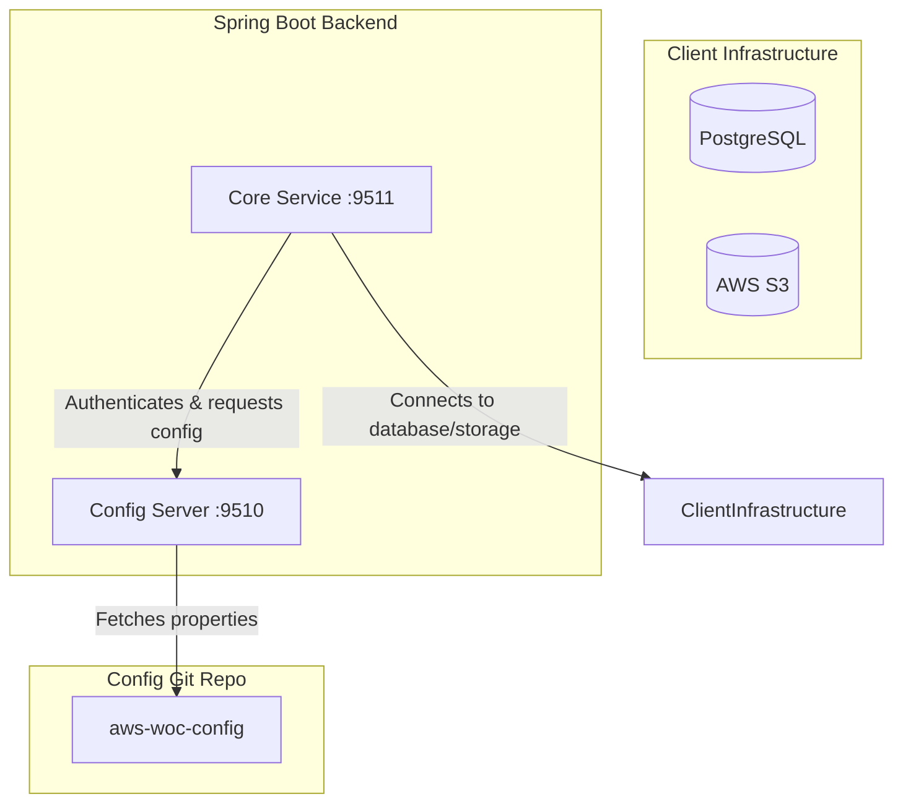

# AWS WOC Backend Services

Welcome to the backend service ecosystem of the **AWS WOC** (Wall of Commitment) application. This repository is built as a multi-module Maven project using **Java 21** and **Spring Boot 3.5.x**.

---

## 1. System Architecture

The backend implements a centralized configuration management architecture to separate environment properties from the codebase:



1. **`config-server` (Port 9510)**: A Spring Cloud Config Server that acts as a central configuration manager. It reads environment-specific configuration files (`core-dev.properties`, `core-prod.properties`, etc.) from a remote, secure Git repository.
2. **`core` (Port 9511)**: The core business logic service. At startup, it calls the `config-server` using basic authentication to dynamically fetch its configuration properties (database connection, storage keys, JWT secret, etc.).

---

## 2. Prerequisites

Ensure you have the following installed on your system before proceeding:

* **Java Development Kit (JDK) 21**: Make sure `JAVA_HOME` is set up correctly in your environment.
* **Apache Maven 3.8+** (or use the included `./mvnw` wrapper).
* **PostgreSQL Database**: A running instance of PostgreSQL.
* **AWS S3 Bucket**: Prepared storage infrastructure for hosting assets.

---

## 3. Directory Layout

```text
aws-woc-backend/
├── config-server/           # Central Spring Cloud Config Server
│   ├── src/main/resources/
│   │   ├── application.properties          # Server configuration file
│   │   └── application.properties.template # Guide/Template for application.properties
│   └── pom.xml
├── core/                    # Core Spring Boot backend service
│   ├── src/main/resources/
│   │   ├── application.properties          # Client boot configuration
│   │   └── application.properties.template # Guide/Template for client boot
│   └── pom.xml
├── mvnw                     # Maven wrapper script for Linux/macOS
├── mvnw.cmd                 # Maven wrapper script for Windows
└── pom.xml                  # Parent POM containing shared properties and dependencies
```

---

## 4. Setup and Run Guide

### Step 1: Configure and Host Your Configurations
The configurations must be hosted in a remote Git repository (e.g. GitHub or Bitbucket).
1. Clone or obtain your configuration files repository (e.g. `aws-woc-config`).
2. Copy `core-template.properties` to create `core-dev.properties` (or `core-prod.properties` / `core-local.properties` as needed).
3. Fill in your PostgreSQL database credentials, JWT secret key, and AWS keys in the copied properties file.
4. Commit and push the configuration repository to a secure, private remote Git repository.

### Step 2: Configure the Config Server (`config-server`)
1. Open [config-server/src/main/resources/application.properties](file:///c:/Z/monkhub/aws-woc/aws-woc-backend/config-server/src/main/resources/application.properties).
2. Configure the Git connection parameters to point to your configuration repository:
   ```properties
   spring.cloud.config.server.git.uri=https://<GIT_USER>@<GIT_HOST>/<ORG_NAME>/aws-woc-config.git
   spring.cloud.config.server.git.username=<GIT_USER>
   spring.cloud.config.server.git.password=<GIT_ACCESS_TOKEN_OR_APP_PASSWORD>
   ```
3. Set custom credentials to protect Config Server endpoints:
   ```properties
   spring.security.user.name=<CHOOSE_A_USERNAME>
   spring.security.user.password=<CHOOSE_A_PASSWORD>
   ```

### Step 3: Configure Core Client (`core`)
1. Open [core/src/main/resources/application.properties](file:///c:/Z/monkhub/aws-woc/aws-woc-backend/core/src/main/resources/application.properties).
2. Update the credentials to match what you configured in Step 2:
   ```properties
   spring.cloud.config.username=<CONFIG_SERVER_USERNAME>
   spring.cloud.config.password=<CONFIG_SERVER_PASSWORD>
   ```
3. Ensure the active profile (`spring.profiles.active=dev`) matches the environment properties file suffix in your config repo (e.g., `dev` matches `core-dev.properties`).

---

## 5. Building and Running the Applications

Open your terminal in the root project folder (`aws-woc-backend`):

### 1. Build the multi-module project
```bash
# Using local Maven
mvn clean install

# Or using the Maven Wrapper (Windows CMD)
mvnw.cmd clean install

# Or using the Maven Wrapper (PowerShell / Unix)
./mvnw clean install
```

### 2. Start the Config Server
The config server must start **first** to serve properties to the core application:
```bash
mvn spring-boot:run -pl config-server
```
Confirm the config server is running successfully by checking `http://localhost:9510/core/dev`.

### 3. Start the Core Service
With the Config Server running, start the core service in a separate terminal:
```bash
mvn spring-boot:run -pl core
```

Once successfully started, the server will log that Tomcat is listening on port `9511`. You can access the API Swagger documentation console at:
`http://localhost:9511/swagger-ui/index.html`
